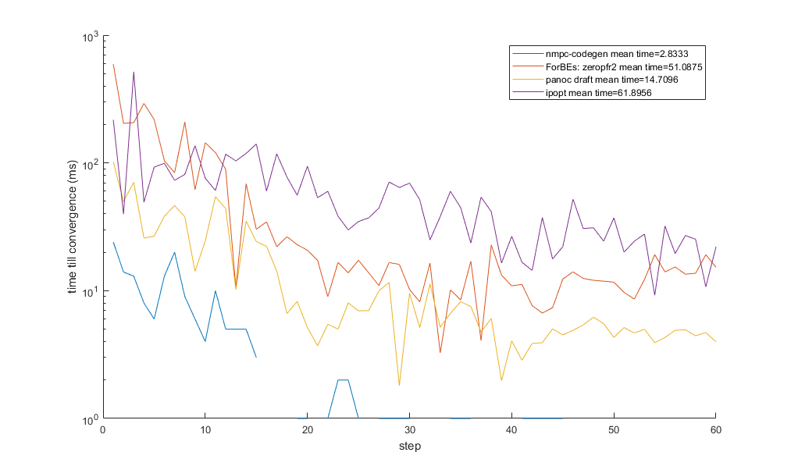

# Draf_panoc
A simple library of the panoc algorithm with indicator box.

## TODO
- Matlab recompiled library
- Python interface
- C#.NET interface

# Tips
Check out the Readme in the Matlab folder. It explains how to compile/install the matlab interface.